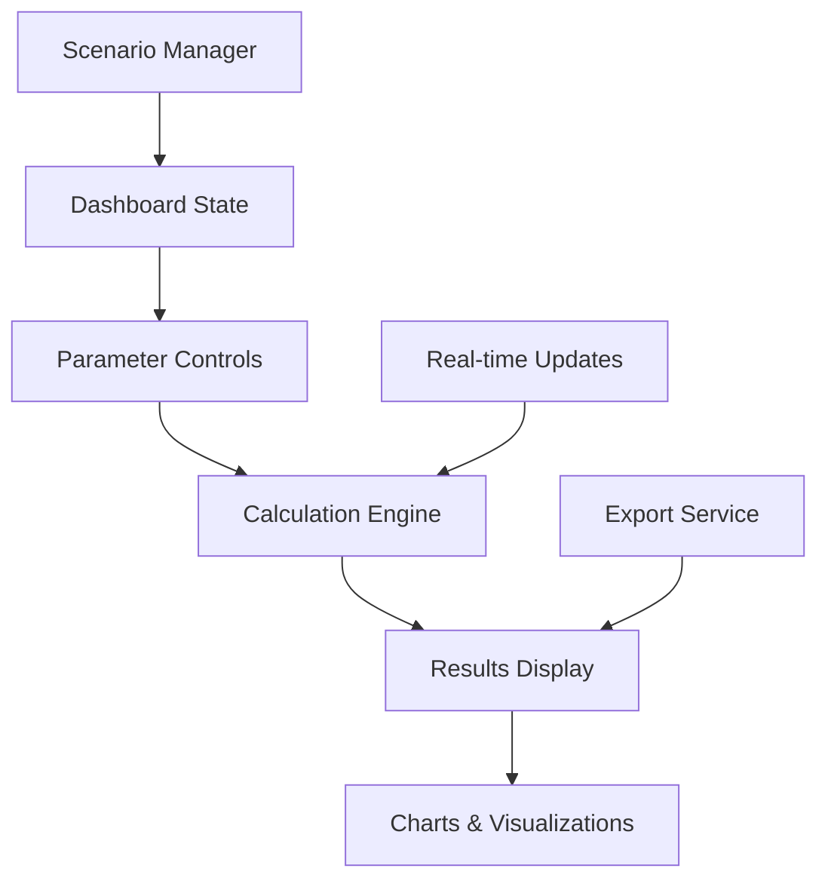

# Design Document

## Overview

This design outlines the implementation of the pension simulator dashboard as specified in point 1.4 of the app specification. The dashboard provides advanced pension simulation capabilities with detailed parameter customization, allowing users to explore different retirement scenarios through interactive charts, detailed parameter controls, and real-time calculations.

The dashboard builds upon the existing pension results display components and extends them with advanced editing capabilities, data visualization, and scenario management features.

## Architecture

### Component Hierarchy

```
DashboardPage
├── DashboardHeader (navigation, scenario management)
├── DashboardSidebar (parameter controls)
│   ├── BasicParametersPanel
│   ├── SalaryTimelinePanel
│   ├── SickLeavePanel
│   └── IndexationPanel
├── DashboardMainContent
│   ├── ResultsSummaryCard
│   ├── ZUSAccountGrowthChart
│   ├── SalaryProjectionChart
│   └── ComparisonTable
└── DashboardFooter (export, save options)
```

### Data Flow Architecture



### State Management

The dashboard uses a centralized state management approach:

- **Dashboard Context** - Manages all simulation parameters and results
- **Scenario Manager** - Handles saving/loading different configurations
- **Calculation Service** - Performs real-time pension calculations
- **Chart Data Provider** - Transforms calculation results for visualization

## Components and Interfaces

### Core Components

#### 1. DashboardPage
- **Purpose**: Main container orchestrating the entire dashboard experience
- **Features**: Layout management, state coordination, real-time updates
- **Integration**: Receives initial data from SimulationResultPage

#### 2. DashboardSidebar
- **Purpose**: Houses all parameter control panels
- **Features**: Collapsible sections, form validation, real-time preview
- **Panels**:
  - Basic Parameters (age, salary, years)
  - Salary Timeline (year-by-year salary inputs)
  - Sick Leave Management (historical and future periods)
  - Indexation Settings (wage growth rates, inflation)

#### 3. ZUSAccountGrowthChart
- **Purpose**: Visualizes pension account balance growth over time
- **Features**: Interactive timeline, contribution breakdowns, projection scenarios
- **Technology**: Recharts with custom styling

#### 4. SalaryProjectionChart
- **Purpose**: Shows salary progression with indexation and user adjustments
- **Features**: Historical vs projected data, multiple indexation scenarios
- **Interactivity**: Click to edit specific years, drag to adjust trends

#### 5. ComparisonTable
- **Purpose**: Side-by-side comparison of different scenarios
- **Features**: Sortable columns, export functionality, highlight differences
- **Data**: Pension amounts, replacement rates, account balances

### Data Models

#### DashboardState Interface
```javascript
/**
 * @typedef {Object} DashboardState
 * @property {SimulationParameters} parameters - Current simulation parameters
 * @property {CalculationResults} results - Current calculation results
 * @property {Scenario[]} scenarios - Saved scenarios for comparison
 * @property {ChartData} chartData - Processed data for visualizations
 * @property {UIState} uiState - Dashboard UI state (panels, loading, etc.)
 */
```

#### SimulationParameters Interface
```javascript
/**
 * @typedef {Object} SimulationParameters
 * @property {BasicParameters} basic - Age, gender, basic salary, years
 * @property {SalaryTimeline} salaryTimeline - Year-by-year salary data
 * @property {SickLeaveData} sickLeave - Sick leave periods and settings
 * @property {IndexationSettings} indexation - Wage growth and inflation rates
 * @property {ZUSAccountSettings} zusAccount - Account balance and contributions
 */
```

#### SalaryTimeline Interface
```javascript
/**
 * @typedef {Object} SalaryTimeline
 * @property {SalaryEntry[]} entries - Year-by-year salary entries
 * @property {boolean} useCustomValues - Whether to use custom or indexed values
 * @property {number} defaultGrowthRate - Default annual growth rate
 */

/**
 * @typedef {Object} SalaryEntry
 * @property {number} year - Calendar year
 * @property {number} amount - Salary amount for that year
 * @property {boolean} isCustom - Whether user provided this value
 * @property {boolean} isProjected - Whether this is a future projection
 */
```

#### SickLeaveData Interface
```javascript
/**
 * @typedef {Object} SickLeaveData
 * @property {'averaged' | 'custom'} mode - Sick leave calculation mode
 * @property {SickLeavePeriod[]} historicalPeriods - Past sick leave periods
 * @property {SickLeavePeriod[]} projectedPeriods - Future sick leave periods
 * @property {AveragedSickLeave} averagedData - Statistical averages by demographics
 */

/**
 * @typedef {Object} SickLeavePeriod
 * @property {string} startDate - Start date (ISO format)
 * @property {string} endDate - End date (ISO format)
 * @property {number} daysCount - Number of sick days
 * @property {number} salaryReduction - Percentage reduction in contributions
 */
```

## User Interface Design

### Layout Structure

#### Desktop Layout (1200px+)
- **Left Sidebar**: 320px wide, parameter controls
- **Main Content**: Flexible width, charts and results
- **Right Panel**: 280px wide, scenario comparison (collapsible)

#### Tablet Layout (768px - 1199px)
- **Top Navigation**: Scenario and export controls
- **Collapsible Sidebar**: Full-height overlay when open
- **Main Content**: Full width when sidebar closed

#### Mobile Layout (<768px)
- **Bottom Sheet**: Parameter controls in sliding panel
- **Stacked Layout**: Charts and results in vertical stack
- **Simplified Controls**: Grouped parameters in tabs

### Visual Design System

#### Color Scheme (ZUS Branding)
- **Primary Actions**: ZUS Orange (#FFB34F)
- **Success States**: ZUS Green (#009F3F)
- **Information**: ZUS Blue (#3F84D2)
- **Neutral Elements**: ZUS Gray (#BEC3CE)
- **Dark Text**: ZUS Navy (#00416E)

#### Typography Scale
- **Dashboard Title**: 2rem, bold
- **Section Headers**: 1.5rem, semibold
- **Parameter Labels**: 1rem, medium
- **Chart Labels**: 0.875rem, regular
- **Helper Text**: 0.75rem, regular

#### Interactive Elements
- **Form Controls**: Rounded corners (8px), focus rings
- **Charts**: Hover states, tooltips, interactive legends
- **Buttons**: Consistent sizing, loading states
- **Cards**: Subtle shadows, hover elevation

## Data Visualization Strategy

### Chart Types and Usage

#### 1. ZUS Account Growth Chart (Line Chart)
- **X-axis**: Years from start of career to retirement
- **Y-axis**: Account balance in PLN
- **Features**: 
  - Multiple lines for different scenarios
  - Contribution markers for significant events
  - Interactive tooltips with yearly details
  - Zoom and pan capabilities

#### 2. Salary Projection Chart (Area Chart)
- **X-axis**: Years from start of career to retirement
- **Y-axis**: Annual salary in PLN
- **Features**:
  - Historical data (solid area)
  - Projected data (gradient area)
  - Indexation trend lines
  - Click-to-edit functionality

#### 3. Pension Breakdown Chart (Stacked Bar)
- **Categories**: Different pension components
- **Values**: Contribution amounts and growth
- **Features**:
  - Hover details for each component
  - Comparison between scenarios
  - Export to data table

#### 4. Replacement Rate Gauge
- **Display**: Circular progress indicator
- **Value**: Pension as percentage of final salary
- **Features**:
  - Color coding (red/yellow/green zones)
  - Target vs actual indicators
  - Animated transitions

### Accessibility in Charts

- **Alternative Text**: Comprehensive descriptions for screen readers
- **Data Tables**: Tabular alternatives for all visual data
- **Keyboard Navigation**: Full keyboard control of interactive elements
- **High Contrast**: Support for high contrast display modes
- **Motion Preferences**: Respect reduced motion settings

## Real-time Calculation Engine

### Calculation Flow

1. **Parameter Change Detection**: Debounced input monitoring
2. **Validation**: Client-side parameter validation
3. **Calculation**: Local pension calculation algorithms
4. **Result Processing**: Transform results for display components
5. **UI Update**: Update charts, tables, and summary cards

### Performance Optimizations

- **Debounced Updates**: 300ms delay for real-time calculations
- **Memoized Results**: Cache calculations for unchanged parameters
- **Progressive Loading**: Load charts incrementally
- **Virtual Scrolling**: For large data tables
- **Web Workers**: Heavy calculations in background threads

## Error Handling and Validation

### Input Validation

- **Real-time Validation**: Immediate feedback on parameter changes
- **Range Checking**: Ensure values are within realistic bounds
- **Consistency Checks**: Validate relationships between parameters
- **Format Validation**: Proper date and currency formatting

### Error States

- **Calculation Errors**: Clear error messages with suggested fixes
- **Data Loading Errors**: Retry mechanisms and fallback states
- **Validation Errors**: Inline error messages with guidance
- **Network Errors**: Offline mode with cached data

## Testing Strategy

### Unit Testing
- **Calculation Engine**: Test all pension calculation algorithms
- **Component Logic**: Test parameter handling and state management
- **Validation Functions**: Test input validation and error handling
- **Chart Data Processing**: Test data transformation functions

### Integration Testing
- **Dashboard Flow**: Test complete user workflows
- **Real-time Updates**: Test parameter changes and recalculations
- **Scenario Management**: Test saving, loading, and comparing scenarios
- **Export Functionality**: Test data export in various formats

### Accessibility Testing
- **Screen Reader Testing**: Test with NVDA, JAWS, and VoiceOver
- **Keyboard Navigation**: Test complete keyboard workflows
- **Color Contrast**: Verify WCAG AA compliance
- **Motion Sensitivity**: Test with reduced motion preferences

### Performance Testing
- **Calculation Speed**: Benchmark calculation performance
- **Chart Rendering**: Test chart performance with large datasets
- **Memory Usage**: Monitor memory consumption during long sessions
- **Mobile Performance**: Test on various mobile devices

## Implementation Phases

### Phase 1: Core Dashboard Structure
- Dashboard page layout and navigation
- Basic parameter controls
- Simple calculation engine
- Results display integration

### Phase 2: Advanced Parameter Controls
- Salary timeline editor
- Sick leave management
- Indexation settings
- Real-time validation

### Phase 3: Data Visualization
- ZUS account growth chart
- Salary projection chart
- Interactive chart features
- Responsive chart layouts

### Phase 4: Scenario Management
- Save and load scenarios
- Scenario comparison
- Export functionality
- Sharing capabilities

### Phase 5: Polish and Optimization
- Performance optimizations
- Accessibility enhancements
- Mobile experience refinement
- Comprehensive testing