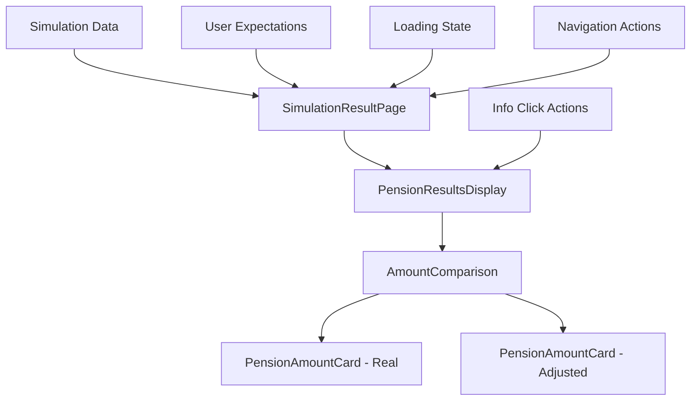

# Design Document

## Overview

This design outlines the integration of the existing pension results display component from the `pension-results-display` folder into the main front application. The integration will transform the current placeholder `SimulationResultPage.jsx` into a comprehensive results display that implements point 1.3 of the app specification.

The design leverages the existing React components, TypeScript types, and utility functions from the pension-results-display module while adapting them to work within the main application's architecture and routing system.

## Architecture

### Component Integration Strategy

The integration follows a modular approach where we:

1. **Copy and adapt core components** from pension-results-display into the front/src structure
2. **Maintain TypeScript types** by converting them to JavaScript with JSDoc comments for consistency
3. **Integrate with existing routing** by updating SimulationResultPage.jsx
4. **Preserve ZUS branding** by using the defined color palette and design system
5. **Ensure accessibility** by maintaining WCAG 2.0 compliance features

### File Structure

```
front/src/
├── components/
│   └── pension-results/
│       ├── PensionResultsDisplay.jsx
│       ├── PensionAmountCard.jsx
│       ├── AmountComparison.jsx
│       └── index.js
├── types/
│   └── pension-results.js (JSDoc types)
├── utils/
│   ├── pension-formatting.js
│   └── pension-accessibility.js
├── constants/
│   └── zus-colors.js
└── pages/
    └── SimulationResultPage.jsx (updated)
```

## Components and Interfaces

### Core Components

#### 1. PensionResultsDisplay
- **Purpose**: Main container component that orchestrates the entire results display
- **Props**: simulationResults, userExpectations, loading, onNavigateToDetails
- **Features**: Header section, main content area, navigation controls
- **Integration**: Replaces the TODO content in SimulationResultPage.jsx

#### 2. PensionAmountCard
- **Purpose**: Displays individual pension amounts with animations and accessibility features
- **Props**: amount, title, subtitle, type, loading, animationDelay, onInfoClick
- **Features**: CountUp animations, hover effects, accessibility labels, info tooltips
- **Variants**: Real amount card, Adjusted amount card

#### 3. AmountComparison
- **Purpose**: Side-by-side comparison of real vs adjusted pension amounts
- **Props**: realAmount, adjustedAmount, loading, onInfoClick
- **Features**: Responsive grid layout, loading states, comparison indicators

### Data Flow



### State Management

The component integration uses React's built-in state management:

- **Props drilling** for passing simulation data from page to components
- **Local state** for loading states, animations, and UI interactions
- **Callback props** for handling navigation and user interactions
- **Context consideration** for future expansion if state becomes complex

## Data Models

### SimulationResults Interface (JavaScript with JSDoc)

```javascript
/**
 * @typedef {Object} SimulationResults
 * @property {number} realAmount - Rzeczywista wysokość emerytury
 * @property {number} adjustedAmount - Urealniona wysokość emerytury
 * @property {number} averagePensionAtRetirement - Średnia wysokość emerytury w roku przejścia
 * @property {number} replacementRate - Stopa zastąpienia (w procentach)
 * @property {number} salaryWithoutSickLeave - Wynagrodzenie bez okresów chorobowych
 * @property {number} salaryWithSickLeave - Wynagrodzenie z okresami chorobowymi
 * @property {number} pensionWithoutSickLeave - Emerytura bez okresów chorobowych
 * @property {number} pensionWithSickLeave - Emerytura z okresami chorobowymi
 * @property {DelayBenefits} delayBenefits - Korzyści z odroczenia emerytury
 * @property {number} retirementYear - Rok przejścia na emeryturę
 * @property {number} currentAge - Obecny wiek użytkownika
 * @property {boolean} includedSickLeave - Czy uwzględniono okresy chorobowe
 */

/**
 * @typedef {Object} DelayBenefits
 * @property {number} oneYear - Korzyść z odroczenia o 1 rok
 * @property {number} twoYears - Korzyść z odroczenia o 2 lata
 * @property {number} fiveYears - Korzyść z odroczenia o 5 lat
 */

/**
 * @typedef {Object} UserExpectations
 * @property {number} expectedAmount - Oczekiwana wysokość emerytury
 * @property {number} [additionalWorkYearsNeeded] - Dodatkowe lata pracy potrzebne
 */
```

### ZUS Color Palette

```javascript
export const zusColors = {
  primary: '#FFB34F',    // R: 255; G:179; B:79
  success: '#009F3F',    // R: 0; G: 153; B: 63
  neutral: '#BEC3CE',    // R: 190; G: 195; B: 206
  info: '#3F84D2',       // R: 63; G: 132; B: 210
  dark: '#00416E',       // R: 0: G: 65; B: 110
  error: '#F05E5E',      // R: 240; G: 94; B: 94
  text: '#000000',       // R: 0; G: 0; B: 0
};
```

## Error Handling

### Component Error Boundaries

- **PensionResultsDisplay**: Wrap in error boundary to catch rendering errors
- **Fallback UI**: Display user-friendly error message with retry option
- **Data validation**: Validate simulation results before rendering
- **Loading states**: Handle async data loading with appropriate feedback

### Error Scenarios

1. **Missing simulation data**: Show message prompting user to complete simulation
2. **Invalid data format**: Display error with option to restart simulation
3. **Component rendering errors**: Show fallback UI with error reporting
4. **Network errors**: Handle API failures gracefully with retry mechanisms

## Testing Strategy

### Unit Testing

- **Component rendering**: Test all components render correctly with valid props
- **Props validation**: Test components handle missing or invalid props gracefully
- **User interactions**: Test click handlers, navigation, and info button functionality
- **Accessibility**: Test ARIA labels, keyboard navigation, and screen reader compatibility

### Integration Testing

- **Page integration**: Test SimulationResultPage correctly integrates pension results display
- **Data flow**: Test data passes correctly from page to child components
- **Navigation**: Test navigation between simulation form and results page
- **State management**: Test loading states and data updates

### Visual Testing

- **Responsive design**: Test components on different screen sizes
- **Animation testing**: Test CountUp animations and card entrance effects
- **Color compliance**: Verify ZUS color palette implementation
- **Accessibility testing**: Test with screen readers and keyboard navigation

### Performance Testing

- **Animation performance**: Test smooth animations on various devices
- **Component mounting**: Test fast component initialization
- **Memory usage**: Test for memory leaks in animations and state updates
- **Bundle size**: Monitor impact on application bundle size

## Implementation Phases

### Phase 1: Core Component Integration
- Copy and adapt PensionAmountCard component
- Copy and adapt AmountComparison component
- Create utility functions for formatting and accessibility
- Set up ZUS color constants

### Phase 2: Main Display Component
- Implement PensionResultsDisplay component
- Integrate with SimulationResultPage
- Add loading states and error handling
- Implement basic navigation

### Phase 3: Enhanced Features
- Add animations and transitions
- Implement accessibility features
- Add info tooltips and explanations
- Optimize performance

### Phase 4: Testing and Polish
- Add comprehensive tests
- Perform accessibility audit
- Optimize animations and performance
- Final integration testing